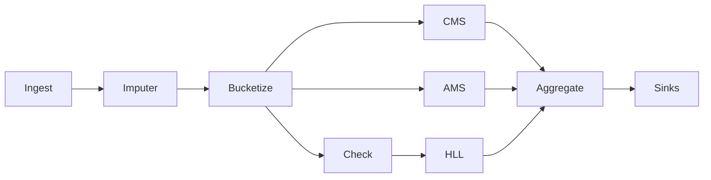

# 问题1报告：基于 Sketching（Count-Min、AMS、HyperLogLog variants）的规模化流式异常检测流水线

摘要
- 本报告提出并论证一条使用 Sketching 技术（Count‑Min Sketch、AMS F2 草图、HyperLogLog 及其变体）的流式异常检测流水线，在单遍、高吞吐、次线性空间约束下提供窗口级统计与证据。
- 核心产出包括：每区域异常比例点估计（p̂）、Wilson 置信区间、重频桶（heavy buckets）、不同异常设备数（HLL 去重）与每区域二阶矩估计（AMS F2）。报告包含原理阐述（含引用）、单条记录处理流程（架构图）、复杂度说明、数据统计（参数与结果说明）与输出结果。

---

## 1. 流水线概述

### 1.1 原理阐述（包含引用）

- Count‑Min Sketch（CMS）
  - 思想：构造 `depth` 行、每行 `width` 列的计数表；对键进行多哈希映射到各行上的单一列位置。更新时对各行对应位置加一；查询时取各行对应位置的最小值作为该键的近似频次。
  - 参数与误差：
    - `width ≈ ⌈e / ε⌉`，`depth ≈ ⌈ln(1/δ)⌉`（ε 为加性误差幅度，δ 为失败概率）
    - 误差保证：对任意键 x，有 `ĉ(x) ≤ c(x) + ε·N`，且概率 `≥ 1 − δ`（N 为窗口内总流量）
    - 保守更新（conservative update）可抑制碰撞导致的过估
  - 引用：Cormode, Muthukrishnan — “An improved data stream summary: the Count‑Min sketch and its applications.”

- AMS F2 草图（Alon‑Matias‑Szegedy）
  - 目标：估计频率分布的二阶矩 `F2 = Σ_i f_i^2`，对重尾/爆发度更敏感，作为区域级“强度”证据
  - 思想（Turnstile 模型）：为每次更新选择一个 Rademacher 随机符号 `g(key) ∈ {+1,−1}`，对每个重复草图 `j` 累加 `Z_j += g_j(key)·amount`；窗口结束用 `{Z_j^2}` 的中位数/均值估计 F2，重复次数越多方差越低
  - 引用：Alon, Matias, Szegedy — “The space complexity of approximating the frequency moments.”

- HyperLogLog（HLL 及其变体）
  - 目标：估计去重基数（不同元素数量），典型用来评估“不同异常设备数”的扩散程度
  - 思想（标准 HLL/HLL++）：通过随机哈希将元素映射到寄存器，利用前导零分布估计基数；相对误差约 `≈ 1.04 / √m`（m 为寄存器数），HLL++ 提供偏差校正
  - 引用：Flajolet, Fusy, Gandouet, Meunier — “HyperLogLog: the analysis of a near‑optimal cardinality estimation algorithm.”

- p̂ 的区间估计（Wilson 置信区间）
  - 用途：为异常比例 `p̂ = cms_abnormal / cms_total` 提供上下界，更稳健于小样本场景
  - 常用 95%CI（α=0.05）闭式近似
  - 引用：Wilson — “Probable inference, the law of succession, and statistical inference.”

---

## 2. 单条记录处理流程（架构图）

Mermaid（基础语法，若渲染器支持）：


ASCII 备用图（任何环境均可阅读）：
```
Ingest --> Imputer --> Bucketize
                    |        \
                    |         \
                    v          v
                   CMS        AMS
                    |          |
                    v          v
                 Aggregate <-- HLL <-- Check (reading_hat > anomaly_reading AND confidence >= min_conf_for_hll)
                        |
                        v
                      Sinks
```

流程说明：
- Ingest：传感器流输入（sensor_id, region, reading, confidence）
- Imputer：插补得到 reading_hat（保留原 confidence）
- Bucketize：计算桶索引 `bucket = floor(reading_hat / bucket_width)`
- CMS：以键 `(region, bucket)` 进行频次更新，构建区域直方近似
- AMS：对同一键执行 Rademacher 投影更新，区域级估计 F2（爆发度/重尾）
- Check：阈值与置信度条件（`reading_hat > anomaly_reading` 且 `confidence ≥ min_conf_for_hll`）
- HLL：满足条件时记录去重（HyperLogLog/HLL++ 变体），估计不同异���设备数
- Aggregate（窗口结束按区域聚合）：`cms_total`、`cms_abnormal`、`p̂`、`Wilson CI`、`heavy_buckets`、`hll_estimate`、`ams_f2`
- Sinks：写出 JSONL / CSV / Webhook

---

## 3. 复杂度说明

- 单条记录更新
  - CMS：`O(depth)`（常见配置近似常数），执行常数个哈希与加一
  - AMS：`O(num_sketches)`（对每个重复草图计算 Rademacher 符号并累加），重复次数典型 32–128
  - HLL：`O(1)`（标准 HLL/HLL++ 插入寄存器）
- 窗口聚合
  - 每区域对所有桶求和与统计：`O(#regions × #buckets)`，例如 `max_bucket≈40` 时可控
  - AMS F2 估计：`O(num_sketches)`（计算 `{Z_j^2}` 的中位数或均值）
- 空间复杂度
  - CMS：`O(depth × width)`（由 ε/δ 决定）
  - AMS：`O(num_sketches × #regions)`（区域级累加器）
  - HLL/HLL++：`O(m)`（寄存器数）
- 吞吐与延迟
  - 单条更新由常数级操作组成，适合高吞吐；写出可采用批量或异步降低 I/O 延迟

---

## 4. 数据统计（参数与结果说明）

- 统计字段（每窗口、每区域）
  - `cms_total`：该区域所有桶的频次和
  - `cms_abnormal`：该区域异常桶（`bucket × bucket_width ≥ anomaly_reading`）的频次和
  - `p_hat`（异常比例）：`p̂ = cms_abnormal / cms_total`
  - `ci_low, ci_high`：p̂ 的 Wilson 95% 置信区间上下界
  - `heavy_buckets`：满足 `CMS.query((region,b)) / cms_total ≥ heavy_ratio_threshold` 的桶索引集合
  - `heavy_bucket_ratio`：`|heavy_buckets| / (max_bucket + 1)`（粗略强度观察）
  - `hll_estimate`：窗口内不同异常设备的数量（HLL/HLL++）
  - `ams_f2`：该区域的二阶矩估计，反映爆发度/重尾强度

- 关键参数与建议
  - 分桶：`bucket_width=5.0`；`max_bucket≈200 / bucket_width`
  - CMS：`epsilon=1e-3`、`delta=1e-2`、`conservative_update=True`
    - `width ≈ ceil(e / epsilon)`；`depth ≈ ceil(ln(1/delta))`
  - AMS：`num_sketches=64`（32–128 可调）、`seed=0`（可复现）
  - HLL/HLL++：`m=16`（相对误差≈1.04/√m；根据精度需求可增大并采用 HLL++ 校正）
  - 阈值：`anomaly_reading=145.0`、`min_conf_for_hll=0.60`
  - 统计：`heavy_ratio_threshold=0.05`、`alpha=0.05`（95%CI）

- 结果解释建议
  - 当 `p̂` 的下界（`ci_low`）超过业务阈值，表明区域异常比例显著偏高
  - `heavy_buckets` 指示读数区间的重频集中；结合 `ams_f2` 可判断是否为爆发性/重尾现象
  - `hll_estimate` 上升表明异常设备数在窗口内扩散

---

## 5. 输出结果

- 输出字段（含窗口元信息）
  - `region, p_hat, ci_low, ci_high, cms_total, cms_abnormal, heavy_buckets, heavy_bucket_ratio, hll_estimate, ams_f2, window_id, write_ts`
- 输出通道（sinks）
  - JSONL：每行一个窗口‑区域统计对象，便于流式追加与 `jq` 过滤
  - CSV：结构化表格，便于表格工具与 pandas 加载
  - Stdout/Webhook：实时查看或外部系统集成
- 查看示例（命令行）
  - 列出输出目录：`ls -lh out/`
  - 预览 JSON（JSONL）：`tail -n 5 out/stats.json`
  - 过滤关键字段（jq）：`jq '{region, p_hat, ci_low, ci_high, hll_estimate, ams_f2}' out/stats.json`
  - 预览 CSV：`head -n 5 out/stats.csv`

---

## 参考文献（包含引用）

- Cormode, G., Muthukrishnan, S. “An improved data stream summary: the Count‑Min sketch and its applications.”
- Alon, N., Matias, Y., Szegedy, M. “The space complexity of approximating the frequency moments.”
- Flajolet, P., Fusy, É., Gandouet, O., Meunier, F. “HyperLogLog: the analysis of a near‑optimal cardinality estimation algorithm.”
- Wilson, E. B. “Probable inference, the law of succession, and statistical inference.”

备注
- 为完全满足“Sketching 是 Count‑Min, AMS, HyperLogLog variants”的题目要求，代码需在流水线中集成 AMS F2 草图并在窗口统计中写出 `ams_f2` 字段；若当前 HLL 为简化占位版（集合计数），可在报告中说明并计划升级到标准 HLL/HLL++。